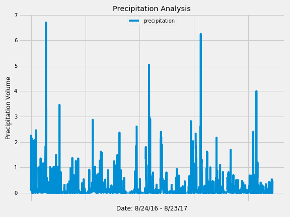

# Climate-Analysis

## Background

I've decided to treat myself to a long holiday vacation in Honolulu, Hawaii! To help with my trip planning, I need to do some climate analysis on the area. The following outlines what I did.

## Step 1: Climate Analysis and Exploration

Use Python and SQLAlchemy to do basic climate analysis and data exploration of climate database. The Jupyter Notebook contains the climate analysis for precipitation and temperature in Honolulu, HI from 08-24-2016 to 08-23-2017 (last twelve months of data). It also looks at specific trip dates from 01-01-2017 to 01-15-2017 to model the climate temperature normals and precipitation based on historical weather data.

Also included an Flask API Application to query:

* Precipitations from last year
* Weather stations
* Temperature Observations (tobs) for the previous year
* Minimum temperature, the average temperature, and the max temperature for a given start and/or start-end range inlcusive.

## Step 2: Create a Climate App

Design a Flask API based on the queries that I have just developed.

* Use FLASK to create routes.

### Final Analysis Charts:

- - -

## Technologies

* Pandas, Jupyter
* Flask
* SQLAlchemy
* Python
